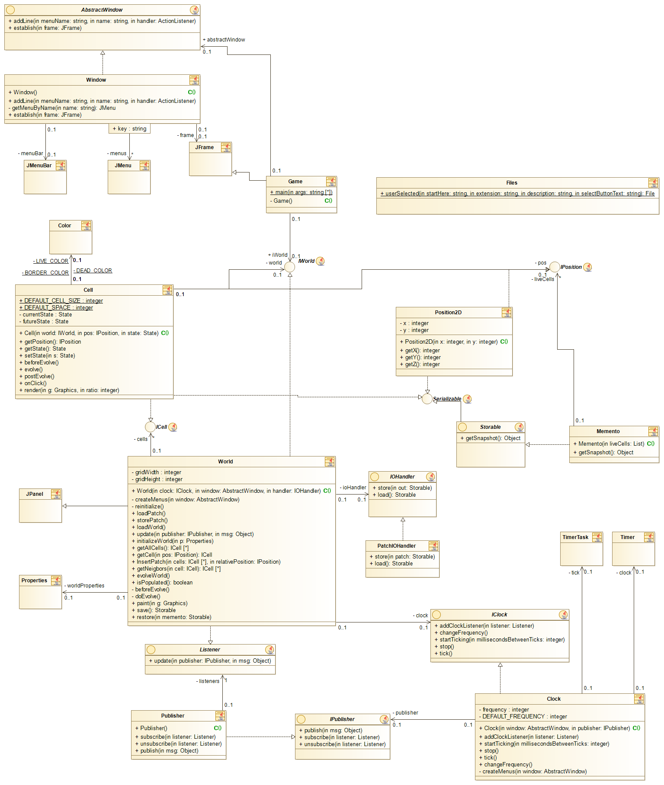
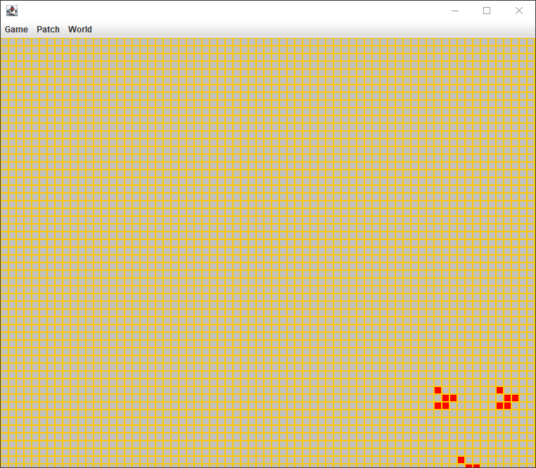

# Game Of Life

Clean implementation of game of life using design patterns.

This is a Netbeans swing GUI project, that implements several design patterns like:

1. Lookup(Service Locator)
2. Abstract Factory
3. Observer
4. Composite
5. Delegator
6. Mediator
7. Memento
8. Facade

## Game Class Diagram

Class diagram is created using Modelio open source project <https://github.com/ModelioOpenSource/Modelio>

## Screenshots

## Video demo

## Contact
For more information and custom software solutions, feel free to reach out to me on Fiverr:

